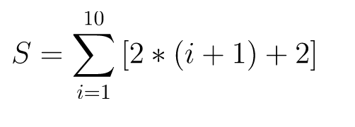

GraalVM comes with a new powerfull compiler called Graal compiler .

Please wait for GraalVM and MAven to be installed on your environment ..

## Task 

Verify Maven is up and running on your environment  
` mvn -version `{{execute}}

Check the installed Java version   
` java --version `{{execute}}

Clone the demo repository  
`git clone https://github.com/graalvm/graalvm-demos.git `{{execute}}

Move to the `java-simple-stream-benchmark` maven project  

`cd graalvm-demos/java-simple-stream-benchmark`{{execute}}

Open the benchmark java source `/home/code/JavaSimpleStreamBenchmark.java`{{open}}
In this file, we perform a set streams operations on integers to complete the following expression

Build the project with maven  
`mvn clean install `{{execute}}

In the next steps, we will be evaluating the performances of this expression towards the GraalVM new JIT compiler and the Hotspot

